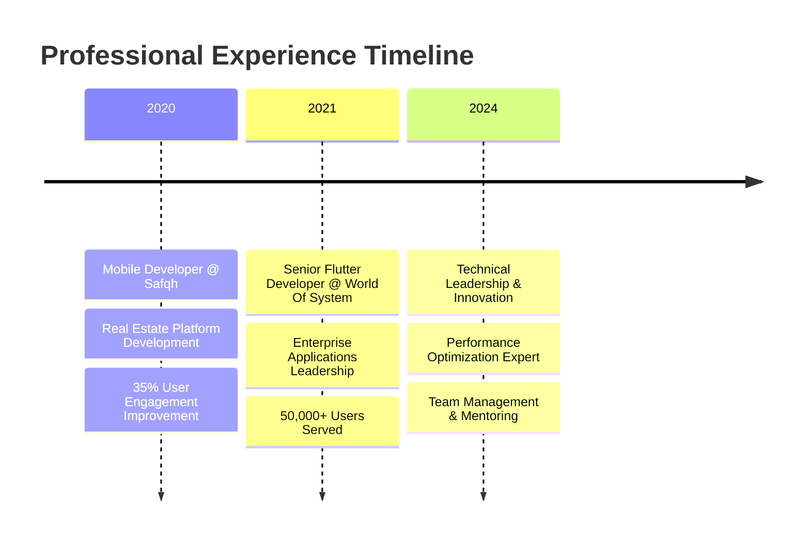

# 👋 Hey there, I'm Amr Ibrahim

<div align="center">
  
</div>

<div align="center">
  
  
  
</div>

---

## 🚀 About Me

```dart
class AmrIbrahim extends FlutterDeveloper {
  final String currentRole = "Senior Flutter Developer";
  final String company = "World Of System and Software";
  final int experienceYears = 4;
  final List<String> expertise = [
    "Cross-Platform Mobile Development",
    "Performance Optimization", 
    "Enterprise Architecture",
    "Team Leadership",
    "Technical Mentoring"
  ];
  
  Map<String, dynamic> getAchievements() {
    return {
      "users_served": "50,000+",
      "development_speed_improvement": "40%",
      "app_stability": "99.9%",
      "bug_detection_improvement": "60%",
      "crash_free_rate": "99%"
    };
  }
  
  Future<void> buildAmazingApps() async {
    while (coding) {
      await create(scalableApps);
      await optimize(performance);
      await mentor(team);
    }
  }
}
```

I'm a **Senior Flutter Developer** at **World Of System and Software**, architecting enterprise-scale mobile applications that serve **50,000+ active users**. I specialize in building high-performance, scalable Flutter applications while leading development teams and driving technical innovation.

---

## 🏆 Professional Impact

<div align="center">

| **Metric** | **Achievement** | **Context** |
|:----------:|:---------------:|:-----------:|
| 👥 **Users Served** | **50,000+** | Enterprise applications |
| 🚀 **Development Speed** | **+40%** | Cycle time reduction |
| 🛡️ **App Stability** | **99.9%** | Production uptime |
| 🐛 **Bug Detection** | **+60%** | Faster identification |
| 📱 **Crash-Free Rate** | **99%** | Session reliability |
| ⚡ **Load Time** | **-40%** | Performance optimization |

</div>

---

## 💼 Current Role & Responsibilities

**🎯 Senior Flutter Developer** @ **World Of System and Software** *(Feb 2021 - Present)*

- **🏗️ Architecture & Leadership**: Lead development of enterprise-scale Flutter applications
- **👥 Team Management**: Coordinate cross-functional teams using Agile/Scrum methodologies  
- **⚡ Performance Engineering**: Achieved 40% reduction in app load times across all products
- **🧪 Quality Assurance**: Implemented automated testing reducing bug detection time by 60%
- **📈 Scalability**: Built systems serving 50,000+ concurrent users with 99.9% stability
- **🛠️ Technical Stack**: Flutter • Dart • Firebase • REST APIs • Cloud Architecture

---

## 🛠️ Technology Stack

<div align="center">

### 📱 **Mobile Development**


### ☁️ **Backend & Cloud**


### 🔧 **Development Tools**


### 📊 **Methodologies**


</div>

---

## 📊 GitHub Analytics

<div align="center">
  
  
</div>

<div align="center">
  
</div>

<div align="center">
  
</div>

---

## 🏗️ Featured Projects

### 📱 **Point Of Sale (POS) System** | *Enterprise Application*
> **🎯 Impact**: Streamlined sales operations for retail businesses across Middle East

**📋 Description**: Comprehensive POS solution featuring sales management, inventory tracking, payment processing with NFC support, and WhatsApp Business integration.

**🔧 Technical Highlights**:
- 💳 **NFC Payment Integration** - Contactless payment support
- 📊 **Real-time Analytics** - Live sales and inventory dashboards  
- 🌐 **Cross-platform Compatibility** - Seamless experience across all devices
- 💬 **WhatsApp Integration** - Automated customer communication

**🛠️ Tech Stack**: `Flutter` `Dart` `NFC APIs` `REST APIs` `Firebase` `Cloud Functions`

<div align="left">
  
[](https://play.google.com/store/apps/details?id=com.worldofss.rassdpos)
[](https://apps.apple.com/sa/app/%D8%B1%D8%B5%D8%AF-pos/id1658746747)

</div>

---

### 🏢 **Commercial Chambers Attestation System** | *Government Digital Transformation*
> **🎯 Impact**: Digitized bureaucratic processes for thousands of Saudi businesses

**📋 Description**: Government-grade application automating electronic attestation processes for commercial chambers in Saudi Arabia, replacing traditional paper-based workflows.

**🔧 Technical Highlights**:
- 🔐 **Government-Grade Security** - Enterprise security protocols
- 📄 **Digital Document Processing** - Automated attestation workflows
- 🏛️ **Multi-Chamber Integration** - Unified system across regions
- ⚡ **Performance Optimization** - Handle high concurrent users

**🛠️ Tech Stack**: `Flutter` `Dart` `Government APIs` `Digital Signatures` `Cloud Infrastructure`

<div align="left">
  
[](https://play.google.com/store/apps/details?id=com.worldofss.scapp)
[](https://apps.apple.com/sa/app/%D8%A8%D9%88%D8%A7%D8%A8%D8%A9-%D8%A7%D9%84%D8%BA%D8%B1%D9%81/id1639993268)

</div>

---

### 📋 **Committee Management Platform** | *Corporate Solutions*
> **🎯 Impact**: Streamlined meeting management for corporate committees

**📋 Description**: Digital platform managing committee meetings, decision tracking, attendance monitoring, and document collaboration with real-time synchronization.

**🔧 Technical Highlights**:
- 📅 **Smart Scheduling** - Automated meeting coordination
- 🗳️ **Decision Tracking** - Digital voting and approval workflows
- 👥 **Attendance Management** - Real-time participant tracking
- 📁 **Document Collaboration** - Secure file sharing and versioning

**🛠️ Tech Stack**: `Flutter` `Dart` `Cloud Storage` `Real-time Database` `WebSocket`

<div align="left">
  
[](https://play.google.com/store/apps/details?id=com.worldofss.committees_mobile)
[](https://apps.apple.com/sa/app/%D8%B1%D8%B5%D8%AF-%D8%A7%D9%84%D8%A7%D8%AC%D8%AA%D9%85%D8%A7%D8%B9%D8%A7%D8%AA/id6461162359)

</div>

---

## 🎓 Certifications & Continuous Learning

### 🏆 **Recent Certifications (2024)**
- **📱 Flutter and Dart: SOLID Principles & Design Patterns** - *Udemy*
- **🧠 Advanced State Management with BLoC** - *Educative.io* 
- **🚀 Complete Flutter Development Mastery** - *Udemy*
- **📊 Dart Developer Professional Track** - *Self-paced*

### 🎯 **Specializations**
- **🏗️ Mobile Architecture**: MVVM, Clean Architecture, Dependency Injection
- **⚡ Performance**: Optimization, Memory Management, Rendering
- **🧪 Testing**: Unit Testing, Widget Testing, Integration Testing  
- **👥 Leadership**: Team Management, Technical Mentoring, Code Reviews

---

## 💼 Professional Journey

<div align="center">



</div>

### 🏢 **Previous Experience**

**📱 Mobile Developer** @ **Safqh** *(Sep 2020 - Feb 2021)*
- 🏠 **Real Estate Focus**: Developed Flutter applications for leading Saudi real estate platform
- 📈 **User Experience**: Improved user engagement by **35%** through advanced UI/UX implementations  
- 🛡️ **Reliability**: Maintained **99% crash-free sessions** across all production releases
- ⚡ **API Optimization**: Reduced API response times by **45%** through efficient caching strategies
- 🔄 **Real-time Features**: Implemented WebSocket connections for live property updates

---

## 🌟 What Sets Me Apart

<div align="center">

| 🎯 **Technical Excellence** | 👥 **Leadership** | 📈 **Business Impact** |
|:--------------------------:|:-----------------:|:----------------------:|
| **SOLID Principles Expert** | **Team Leadership** | **50K+ Users Served** |
| **Performance Optimization** | **Technical Mentoring** | **40% Faster Development** |
| **Clean Architecture** | **Agile Methodology** | **99.9% App Stability** |
| **Advanced Flutter** | **Cross-team Collaboration** | **Enterprise Scale** |

</div>

---

## 📈 Current Focus & Future Goals

```dart
Future<void> continuousGrowth() async {
  final currentFocus = [
    '🔬 Advanced Flutter 3.x features and capabilities',
    '🏗️ Microservices architecture for mobile backends', 
    '🤖 AI/ML integration in mobile applications',
    '🌐 Cross-platform development evolution',
    '👥 Technical leadership and team scaling'
  ];
  
  final upcomingGoals = [
    'Lead mobile architecture for 100K+ user applications',
    'Contribute to Flutter open-source ecosystem',
    'Mentor next generation of Flutter developers',
    'Explore emerging technologies in mobile development'
  ];
  
  await implement(currentFocus);
  await achieve(upcomingGoals);
}
```

---

## 🌐 Let's Connect & Collaborate

<div align="center">

I'm always interested in discussing **Flutter development**, **mobile architecture**, **performance optimization**, and **technical leadership**. Whether you're looking to collaborate on a project, need technical consultation, or want to discuss the latest in mobile development - let's connect!

[](https://www.linkedin.com/in/amri22/)
[](mailto:amrdevmob@gmail.com)
[](https://amr-ibrahim-flutter-dev-wcbj44d.gamma.site/)
[](https://wa.me/201113651272)

**📍 Located in**: Cairo, Egypt | **🌍 Available for**: Remote collaboration worldwide

</div>

---

## 💭 Philosophy

<div align="center">

*"Great mobile applications are not just about beautiful interfaces - they're about solving real problems for real people while maintaining exceptional performance and user experience."*

**🚀 Currently building the future, one Flutter app at a time**

</div>

---

<div align="center">
  
</div>
